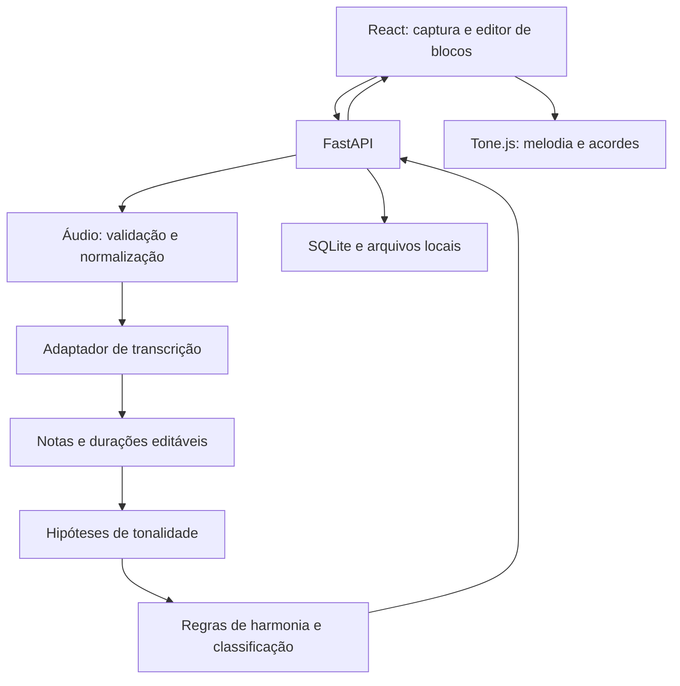

# Plano de Desenvolvimento — MusicPlanner

## 1. Contexto e objetivos

Aplicação web para iniciantes estruturarem músicas e músicos explorarem possibilidades harmônicas. Entrada: frase musical isolada, gravada ou enviada. Saída: hipóteses de tonalidade, harmonizações audíveis e sugestões de continuação organizadas em blocos.

Viabilidade: adequada para um aluno do segundo período com apoio de IA se desenvolvida incrementalmente. Reconhecimento universal de áudio e treinamento de modelos próprios excedem o recorte inicial. A IA ajuda a implementar e explicar; o aluno precisa conseguir executar, depurar e compreender cada etapa. Qualidade musical exige avaliação humana, idealmente de alguém que conheça harmonia.

Recorte proposto, ainda sujeito à validação: pop tonal, maior/menor, 4/4, frases de até 20 segundos, uma nota por vez, sem acompanhamento. BPM informado e metronomo opcional; não assumir detecção automática confiável de ritmo livre. Gênero e caráter emocional são preferências de classificação, não garantias objetivas. Tonalidade automática ou escolhida; alteração de tom deve oferecer transposição da melodia.

Aceite global: usuário confere/corrige notas, compara até três opções distintas quando disponíveis, escolhe acordes, monta e reordena blocos, ouve o conjunto e salva/reabre um projeto. Entrada ambígua apresenta alternativas ou solicita correção. Não inventar três opções se não houver candidatos válidos.

## 2. Diagnóstico investigativo da base

Em 01/10/2026, a raiz contém apenas `.git`. Não há código, manifestos, contratos, banco ou testes. Trata-se de projeto novo, sem migração ou regressão de aplicação existente a administrar. Este documento não confirma instalação ou compatibilidade das dependências.

Riscos centrais: segmentação de notas, erros de oitava, vibrato, notas repetidas, ausência de pulso, ambiguidade tonal e sugestões harmonicamente possíveis mas pouco úteis. Riscos de integração: formatos diferentes produzidos pelo navegador e versões das bibliotecas de áudio. Validar estes riscos antes de investir em interface completa.

## 3. Blueprint arquitetural

### Stack recomendada

| Área | Escolha | Motivo |
|---|---|---|
| Interface | React + TypeScript + Vite | Aplicação interativa sem necessidade inicial de SSR |
| Captura | getUserMedia + MediaRecorder | Gravação no navegador; testar formatos suportados |
| Reprodução | Tone.js | Agendamento musical e síntese no navegador |
| API | Python + FastAPI + Pydantic | Contratos tipados e acesso ao ecossistema de áudio |
| Processamento | NumPy, librosa; FFmpeg para conversão | Normalização e investigação de altura/segmentação |
| Transcrição | Adaptador pYIN ou Basic Pitch, escolhido por experimento | Comparar qualidade e custo no recorte real |
| Teoria musical | music21 + regras próprias pequenas | Representações e análise tonal como ponto de partida |
| Persistência | SQLite + SQLAlchemy; arquivos em diretório local | Execução local simples; migração futura se necessária |
| Validação | pytest; Vitest para lógica de blocos | Testar invariantes musicais e contratos relevantes |

Usar versões fixadas após um teste de instalação no Windows, especialmente se Basic Pitch for escolhido. Não presumir que a versão mais recente de Python suporta todas as dependências. Protótipo preliminar pode ser um script Python, antes de criar React/API.

### Arquitetura: monólito modular

Um backend e um frontend no mesmo repositório. Separar por responsabilidade, com funções simples e contratos explícitos; evitar camadas abstratas sem uso concreto.



Estrutura proposta:

```text
frontend/src/{features/recording,features/analysis,features/blocks,audio,api}
backend/app/{main.py,api,schemas,audio,music,projects}
backend/tests/{unit,integration,fixtures}
docs/DEV_PLAN.md
```

`audio` converte som em eventos; `music` recebe eventos, sem depender de arquivos ou HTTP; `projects` salva blocos; `api` coordena. O motor musical deve funcionar com notas digitadas, mesmo quando a transcrição falhar.

### Modelos e contratos

- NoteEvent: midi_pitch, start_seconds, duration_seconds, detection_score opcional. Score do detector não é probabilidade calibrada de acerto.
- Melody: eventos, origem, BPM informado, notas corrigidas e versão.
- KeyCandidate: tônica, modo, ranking_score e evidências. Ranking não deve aparecer como percentual de certeza sem calibração.
- HarmonyOption: acordes com início/duração em beats, graus, justificativas estruturadas e score.
- Block: id, posição, duração em beats, tonalidade, referência à melodia opcional, acordes e intenção (continuar/contrastar/resolver).
- Project: id, título, gênero, caráter, BPM, compasso, blocos e schema_version.

Preservar segundos originais da transcrição e representar o arranjo em beats. Conversão por BPM e quantização devem ser explícitas, com prévia e correção, pois ritmo livre não se encaixa automaticamente no grid. Blocos sem melodia são permitidos.

Contratos iniciais:

- POST /analyses: multipart com áudio e configurações; retorna eventos e candidatos de tonalidade.
- POST /harmonizations: notas confirmadas, tonalidade selecionada, BPM, gênero e caráter; retorna candidatos.
- POST /continuations: bloco anterior e intenção; retorna progressões para novo bloco, sem prometer gerar melodia.
- POST /projects; GET /projects/{id}; PUT /projects/{id}: salvar e reabrir estrutura versionada.

Protótipo local: processamento com concorrência limitada em executor separado do event loop e requisição aguardando resposta. Mostrar progresso indeterminado e permitir repetir; cancelamento da UI não implica cancelar o processamento. Medir latência antes de decidir por jobs persistidos, polling e worker. BackgroundTasks não substitui fila durável para processamento pesado.

### Motor musical inicial

1. Extrair hipóteses tonais ponderando duração, final de frase e distribuição das classes de altura; usar music21 como baseline, não como veredito.
2. Usuário confirma tonalidade e notas; aceitar alternativas relativas e casos sem evidência suficiente.
3. Gerar candidatos de um catálogo pequeno de progressões em graus, revisado musicalmente.
4. Distribuir acordes por janelas do grid; classificar compatibilidade com notas estruturais, resolução e transições. Notas de passagem não devem ser penalizadas como erros automáticos.
5. Priorizar diversidade entre opções e continuidade entre blocos. Preferências emocionais usam heurísticas declaradas, refinadas com escuta.
6. Explicações iniciais por templates baseados nas regras efetivamente usadas.

### Decisões e alternativas

- Web primeiro: evita desenvolvimento separado Android/iOS.
- Regras antes de modelo próprio: facilita aprendizado, depuração e avaliação sem dataset de treino.
- LLM opcional futuro: explica resultados ou traduz pedidos em parâmetros validados. Não é dependência do motor musical nem recebe áudio por padrão.
- pYIN estima frequência fundamental e vozeamento; segmentação de eventos continua sendo necessária. Basic Pitch oferece transcrição em notas, mas sua adequação deve ser medida.
- SQLite local; PostgreSQL e armazenamento de objetos quando houver multiusuário/deploy que justifique isso.
- Sem microserviços, Redis, Kubernetes, GPU ou filas distribuídas na primeira etapa. Escalar conforme medições.

Erros: mensagens específicas para silêncio, formato inválido, ausência de notas, ambiguidade e falha interna. Logs com request_id, etapa, duração e versão do detector; evitar conteúdo do áudio. Limitar duração, bytes e processamento; validar conteúdo além da extensão. Microfone requer contexto seguro em deploy. Definir exclusão de áudio temporário, sem guardá-lo indefinidamente por acidente. Autenticação e isolamento de projetos são requisitos antes de disponibilizar dados privados a vários usuários.

## 4. Roadmap sequencial de implementação

### Regras de execução e limites do MVP

Executar uma tarefa por vez, validar e registrar resultado antes de avançar. Cada fase entrega algo executável. Os caminhos abaixo são propostas de criação, não arquivos já existentes. Não instalar toda a stack antecipadamente: introduzir dependências quando necessárias.

MVP local/piloto supervisionado: pop tonal como único gênero implementado, caráter neutro/suave/tenso como preferências heurísticas, maior/menor, 4/4, BPM global e melodias isoladas de até 20 segundos. Mostrar apenas escolhas de gênero realmente disponíveis. Começar com tríades diatônicas; notas não diatônicas podem existir na melodia e devem ser tratadas como evidência, não apagadas. Um bloco pode ter 1–4 compassos. Modulação entre blocos fica para depois; todos usam a tonalidade do projeto. O recorte de formatos/modalidades de entrada será fechado pelo experimento de transcrição.

| Etapa | Entrega observável | Depende de |
|---|---|---|
| 0 | Projeto executa localmente | — |
| 1 | Notas conhecidas geram hipóteses tonais | 0 |
| 2 | Melodia recebe harmonizações comparáveis | 1 |
| 3 | Interface toca e permite escolher sugestões | 2 |
| 4 | Gravações são convertidas em eventos | 0; contratos de 1 |
| 5 | Usuário grava, corrige e harmoniza | 3 e 4 |
| 6 | Usuário monta e ouve blocos | 5 |
| 7 | Projeto pode ser salvo e reaberto | 6 |
| 8 | Piloto valida utilidade e estabilidade | 7 |

A etapa 4 pode ser antecipada depois de 1 para investigar risco de áudio. Isso não exige agentes paralelos. Desenvolvimento público multiusuário é extensão condicionada a autenticação e isolamento, não requisito do piloto local.

### Etapa 0 — Fundação executável

- [x] 0.1 Criar `backend/pyproject.toml`, ambiente virtual e `backend/app/main.py`, com FastAPI e rota de saúde; fixar versões compatíveis.
- [x] 0.2 Criar `frontend/package.json` e aplicação React/TypeScript/Vite mínima; cliente HTTP em `frontend/src/api/client.ts`, com URL configurável e CORS de desenvolvimento explícito.
- [x] 0.3 Criar `.gitignore`, exemplos de configuração sem segredos e `README.md` com comandos no Windows; excluir banco, áudio temporário e ambientes do versionamento.
- Aceite: a tela consulta a rota de saúde; build do frontend passa; outro ambiente consegue seguir o README. Não configurar banco ou detector ainda.
- Evidência de execução: instalação em Python 3.12.14/Node 24.19.0; build TypeScript/Vite concluído; `pip check` sem conflitos; `/health` retorna status ok; CORS permite origem local e não autoriza origem não listada; navegador mostra conexão e erro quando a API é desligada. README documentado; reprodução em outro computador ainda não foi verificada.

### Etapa 1 — Notas e tonalidades

Feature: receber uma melodia estruturada e apresentar hipóteses de tom.

- [ ] 1.1 Criar `backend/app/schemas/music.py`: validar pitch MIDI, início não negativo, duração positiva e limite da frase; ordenar eventos e explicitar política de sobreposição para entrada monofônica.
- [ ] 1.2 Criar `backend/app/music/keys.py` com baseline music21, hipóteses maior/menor e evidências; preservar alternativas próximas sem percentuais de certeza.
- [ ] 1.3 Criar `backend/app/music/transpose.py`; transpor sem alterar tempo e recusar resultado fora do intervalo MIDI.
- [ ] 1.4 Criar `backend/app/api/music.py` com `POST /tonalities` para notas manuais/corrigidas; documentar schemas no OpenAPI.
- Validação: `backend/tests/unit/test_keys.py` e `test_transpose.py`, com melodias rotuladas em `fixtures/`; comparar relativas, frase curta, vazio e cromatismo.
- Aceite: exemplos tonais plausíveis recebem candidatos revisados musicalmente; frase ambígua mantém alternativas; usuário pode definir tonalidade mesmo sem conclusão automática.

### Etapa 2 — Harmonização da frase

Feature: sugerir acordes para acompanhar a melodia atual.

- [ ] 2.1 Criar `backend/app/music/catalog.py` com progressões pop em graus e metadados de caráter; revisar exemplos em maior e menor antes de ampliar catálogo.
- [ ] 2.2 Criar `backend/app/music/timing.py`: segundos para beats, origem da frase explícita e quantização opcional; preservar eventos originais. BPM inicial informado, compasso 4/4.
- [ ] 2.3 Criar `backend/app/music/harmonize.py`: janelas de acordes, ranking por notas estruturais, condução simples e resolução; tolerar passagem/dissonância contextual.
- [ ] 2.4 Retornar até três candidatos distintos, cifras, graus, eventos de reprodução e explicações por templates; caráter altera ranking sem rotular emoção como certeza.
- [ ] 2.5 Expor `POST /harmonizations`; registrar versão do catálogo e regras no resultado.
- Validação: `test_harmonize.py` verifica transposição, limites temporais, diversidade e catálogo; revisão por escuta verifica utilidade.
- Aceite: candidatos têm acordes válidos e durações coerentes; casos sem candidatos retornam orientação; a melodia não é modificada silenciosamente para encaixar acordes.

### Etapa 3 — Comparação audível na interface

Feature: experimentar a experiência central com melodias de exemplo, antes do microfone.

- [ ] 3.1 Criar `frontend/src/features/analysis/`: selecionar exemplo, BPM, caráter e tonalidade automática/manual.
- [ ] 3.2 Criar `frontend/src/audio/player.ts` com Tone.js: play/stop de melodia isolada, acordes e conjunto, após gesto do usuário; interromper reprodução anterior ao trocar opção.
- [ ] 3.3 Criar cards de sugestões e detalhe expansível de graus/funções para músicos; explicações simples permanecem disponíveis.
- [ ] 3.4 Implementar estados vazio/carregando/erro/sucesso, seleção de candidato e aviso de alterações ainda não recalculadas.
- Aceite: usuário ouve exemplos, compara opções e escolhe uma; stop interrompe notas; edição invalida sugestões antigas. Verificar agendamento, pausas e sincronização, além do build.

### Etapa 4 — Prova técnica de áudio

Feature: converter gravações curtas em notas, separadamente da interface.

- [ ] 4.1 Criar `backend/app/audio/normalize.py`: validar conteúdo, duração e tamanho; converter via FFmpeg para mono/taxa esperada pelo detector; limpar temporários também em falhas.
- [ ] 4.2 Criar `backend/app/audio/transcribers.py` com contrato único; comparar pYIN com segmentação e Basic Pitch em ambiente isolado.
- [ ] 4.3 Criar `backend/experiments/evaluate_transcription.py` e relatório `docs/TRANSCRIPTION_REPORT.md`. Usar ao menos 12 frases próprias curtas, distribuídas entre canto, assobio e instrumento, mais silêncio/ruído; esse conjunto exploratório não prova generalização.
- [ ] 4.4 Registrar correspondência de eventos com tolerâncias explícitas, falsos positivos, perdas, erros de oitava, latência e memória; avaliar notas repetidas, vibrato e pausas.
- [ ] 4.5 Escolher detector e modalidades suportadas; fixar versões após instalação no Windows. Definir timeout e concorrência medidos no ambiente alvo.
- Aceite: relatório reproduzível mostra limitações e custo. Para cada modalidade anunciada, verificar se a melodia reconhecida é utilizável com correção simples; se exigir reconstrução frequente, restringir entrada antes da etapa 5. Revisar essa decisão com escuta humana.

### Etapa 5 — Gravar, conferir e harmonizar

- [ ] 5.1 Expor `POST /analyses` e pipeline validação → normalização → eventos → hipóteses; executar CPU fora do event loop com concorrência limitada.
- [ ] 5.2 Criar `frontend/src/features/recording/`: upload primeiro; depois microfone com seleção de MIME suportado, limite de 20 segundos, prévia e regravação. Parar tracks ao concluir/sair; não iniciar captura automaticamente.
- [ ] 5.3 Criar editor simples de notas: alterar altura, início/duração, remover e inserir evento; ouvir versão reconhecida e corrigida. Não exigir piano roll sofisticado.
- [ ] 5.4 Reanalisar tonalidade e harmonia após confirmação; descartar respostas de requisições antigas; manter gravação/correções quando houver erro recuperável.
- [ ] 5.5 Oferecer metronomo opcional com fones e BPM manual; mostrar prévia antes de aplicar quantização. Explicar recorte de entrada na tela.
- Validação: integração com formatos efetivamente produzidos pelo navegador escolhido; silêncio, permissão negada, limite, timeout e erro de conversão.
- Aceite: gravação real percorre captura → conferência → escolha tonal → harmonização → audição, sem precisar manipular arquivos internamente. A interface não finge conhecer porcentagem de processamento.

### Etapa 6 — Composição por blocos e continuação

- [ ] 6.1 Criar `backend/app/music/continue.py` e `POST /continuations`: usar acorde final, tom global, intenção e duração do novo bloco; gerar acordes, sem promessa de gerar melodia.
- [ ] 6.2 Criar `frontend/src/features/blocks/`: primeiro bloco a partir da harmonização escolhida; adicionar continuação/contraste/resolução com prévia.
- [ ] 6.3 Implementar duplicar, remover, mover para cima/baixo e substituir opção; começar com botões, sem dependência de drag-and-drop.
- [ ] 6.4 Permitir nova melodia para um bloco ou bloco só com acordes. Se gravação tiver outro tom, oferecer transposição para o projeto; não mudar tom silenciosamente.
- [ ] 6.5 Reproduzir estrutura inteira, indicando bloco ativo; calcular offsets a partir das durações. Prévia de alteração de BPM/tom global e invalidação de sugestões pendentes.
- Validação: testes de offsets, reordenação, fronteiras e BPM; escuta das transições.
- Aceite: usuário monta pelo menos três blocos, compara uma continuação, reordena e ouve tudo sem notas presas nem sobreposições involuntárias.

### Etapa 7 — Salvar e retomar projetos

- [ ] 7.1 Criar `backend/app/projects/models.py` e `repository.py`, SQLite/SQLAlchemy e migração inicial; guardar projeto estruturado com versão, notas confirmadas e acordes selecionados.
- [ ] 7.2 Implementar POST/GET/PUT de projetos, listagem e exclusão explícita; erro não pode sobrescrever projeto válido por conteúdo incompleto.
- [ ] 7.3 Criar tela/lista de projetos, título, salvar e indicador de mudanças pendentes; aviso ao sair com alterações.
- [ ] 7.4 Definir projeto salvo como independente do áudio bruto: persistir notas; excluir áudio temporário após processamento. Informar que a gravação original não será preservada nesta versão.
- Validação: integração de save/load mantém ordem, pitches, durações, BPM, tom e acordes; banco existente abre após reiniciar.
- Aceite: usuário fecha e reabre a aplicação e continua a composição. Piloto local sem contas; acesso público a projetos privados depende da extensão abaixo.

### Etapa 8 — Piloto e fechamento do MVP

- [ ] 8.1 Criar `docs/MVP_VALIDATION.md` com roteiro: gravar frase, conferir, escolher harmonia, adicionar dois blocos, reordenar, salvar e reabrir.
- [ ] 8.2 Executar piloto supervisionado sugerido com 3 iniciantes e 2 músicos; registrar dificuldades, correções e escolhas. Amostra pequena serve para aprendizagem, não comprovação estatística.
- [ ] 8.3 Fixar metas antes das sessões. Proposta inicial: 4/5 concluem o fluxo sem intervenção técnica; 4/5 encontram ao menos uma harmonização que desejam explorar; nenhum projeto salvo é perdido. Revisar metas antes, não durante a avaliação para esconder falhas.
- [ ] 8.4 Medir tempo até primeira opção útil e custo de correção, sem prometer SLA antes dos resultados. Resolver bloqueadores; registrar limitações remanescentes.
- [ ] 8.5 Executar testes relevantes, build e roteiro completo no ambiente documentado; atualizar README e lista de formatos/modalidades suportados.
- Aceite final: critérios globais da seção 1 e roteiro atendidos; falhas críticas corrigidas; limitações visíveis; decisão de seguir ou revisar documentada.

### Extensão condicionada — Piloto público

Se necessário, executar antes de publicar: HTTPS, configuração de produção, autenticação, autorização por proprietário em todas as rotas de projeto, armazenamento persistente, limites de upload/concorrência e política de retenção. Validar que um usuário não consegue acessar projeto de outro. Introduzir jobs duráveis apenas se a latência/volume medidos exigirem. Publicação não faz parte da implementação local automática.

### Backlog após o MVP

Outros gêneros; acordes estendidos e empréstimos modais; modulação; áudio polifônico; detecção automática de pulso; arranjos instrumentais completos; exportação MIDI/WAV; compartilhamento; mobile nativo; LLM conversacional; treino próprio. Nenhum desses itens bloqueia o MVP definido.

Estimativa orientativa, não compromisso: um semestre pode comportar o recorte com dedicação regular. Planejar por critérios de saída, sem datas fictícias enquanto horas disponíveis e experiência não forem conhecidas. Antes de executar cada etapa, confirmar que a anterior está funcional e atualizar checkboxes com evidência.

## 5. Estratégia de testes e validação

Unitários: transposição preserva intervalos/durações; acordes e graus coerentes; entradas ambíguas conservam candidatos; silêncio não gera melodia; notas repetidas e pausas preservadas; quantização não produz duração negativa; ordem e limites de blocos.

Integração: codec -> eventos -> hipóteses -> harmonia; formato inválido; limite de áudio; save/load de projeto. Separar fixtures sintéticas determinísticas de gravações humanas avaliadas. Não depender de treinamento ou downloads nos testes unitários.

Comandos planejados após configuração: `python -m pytest backend/tests`, `npm --prefix frontend run build`, `npm --prefix frontend run test`. Não foram executados: não existe implementação.

Validação musical: reproduzir sugestões; revisão humana de exemplos e utilidade para usuários. Medir acurácia tonal por conjunto de respostas aceitáveis, não impor uma única verdade a frases ambíguas.

## 6. Contingência e rollback

Se detector falhar, permitir notas manuais/corrigidas e manter o motor operacional. Adaptador permite substituição sem alterar contratos musicais. Se análise tonal for inconclusiva, usuário escolhe entre hipóteses ou define tom. Recursos experimentais de gênero ficam isolados em configuração; manter baseline simples. Banco terá migrações versionadas e cópia antes de alteração; formato de projeto inclui versão. Sem dados legados atualmente.

## Referências técnicas consultadas

- FastAPI: https://fastapi.tiangolo.com/
- Tone.js: https://tonejs.github.io/
- MediaRecorder: https://developer.mozilla.org/en-US/docs/Web/API/MediaRecorder
- Basic Pitch: https://github.com/spotify/basic-pitch
- librosa, frequência fundamental: https://librosa.org/doc/dev/auto_tutorials/01-intro/03-f0.html
- music21, análise tonal: https://music21.org/music21docs/usersGuide/usersGuide_15_key.html

As recomendações arquiteturais são decisões para este escopo, não conclusões de benchmark. Instalação, desempenho e precisão ainda precisam ser verificados nas fases iniciais.
